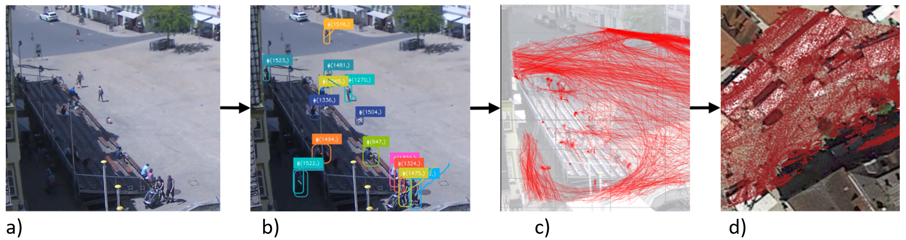
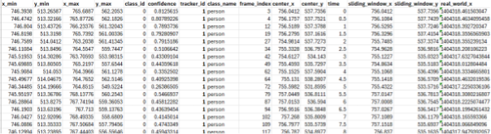

# pedestrian_trajectories
Repository for pedestrian detection from video material including preprocessing of videos, trajectory extraction using YOLOv10 and Bytetrack. Postprocessing of trajectories including georeferencing

**README**

This repository is created to extract pedestrian trajectories from video footage. It was originally created for a research project exploring the movement of pedestrians on European squares. The corresponding Dataset was published on XX and can be found on XX.

The workflow for trajectory extraction entails multiple steps

1. Preprocessing of video file
2. Object detection and trajectory extraction
3. Trajectory processing

Figure : Steps of trajectory extraction: a) raw video footage, b) object detection, c) object tracking, d) georeferencing

1. **Preprocessing of video file**
    1. _Video_preprocessing.py_
        1. Iterates through directory and normalizes videos to a specific duration, fps, and resolution. Folder directories need to be modified in script
2. **Object detection algorithm**
    1. _Object detection.py_
        1. Iterates through a directory running YOLOv10 for object detection and Bytetrack for object tracking on every .mp4 file.
        2. As object detection algorithm a custom trained YOLOv10l_crowdhuman was used.
        3. User needs to modify directories. Furthermore, hyperparameters of Bytetrack and Yolo can be tuned.
        4. Output:
            1. Annotated video
            2. CSV file with trajectories
3. **Trajectory processing**

For the processing of trajectories, multiple files are needed. For the georeferencing a .point file of corresponding feature pairs in pixel- and real-world coordinates is needed. We used the georeferencer tool from QGis for the extraction of the corresponding points.

To exclude data points outside of the study-area, we use a polygon of the study area in real-world coordinates. The polygon file is expected as .csv file with each node coordinate in the columns “real_world_x” and “real_world_y”.

The steps including pre-sets are the following:

- 1. Trajectories with less than 30 frames were removed.
  2. The center coordinates for each human location (y_max = bottom; x_centre=x_max-x_min) were calculated.
  3. Jittering and outliers were removed by applying a sliding window on human coordinates. Window size = 8.
  4. Real-world coordinates were calculated.
        1. Input files: transformation matrix to transform pixel coordinates into real-world coordinates.
        2. Real-world coordinates were saved in the system ESPG: 3857.
  5. Trajectories were masked with the place polygons: Coordinates outside of the place polygon were removed (e.g. when on private ground or road).
  6. Again, all trajectories with less than 30 frames were removed.
  7. The complexity (and size) of trajectories was reduced by reducing the resolution of data points from 15 points per second to two points per second. This increased the processing speed of following calculation steps and removed unneeded complexity. The impact of outliers was reduced by already having calculated the moving average in step 4-c.
  8. A geojson file with all trajectories per place was created. It was used to display trajectories in tools like QGIS or ArcGIS for data validation and visualization.
  9. The walking speed was calculated:
        1. A column with longitude and latitude was added to avoid distortion of the Mercator projection. long and lat were represented in the crs EPSG:4326.
        2. Speed of pedestrians was calculated based on the time column and “real_world_x” and “real_world_y”.
  10. The number of people was calculated for every time of the recording.

**The resulting trajectory file contains the following information:**

| Item | Usage | Type | Format | Unit | Source |
| --- | --- | --- | --- | --- | --- |
| x_min | the left edge of the bounding box in pixel coordinates | Float |     |     | YOLOv10 |
| x_max | the right edge of the bounding box in pixel coordinates | Float |     |     | YOLOv10 |
| y_min | the top edge of the bounding box in pixel coordinates | Float |     |     | YOLOv10 |
| y_max | the bottom edge of the bounding box in pixel coordinates | Float |     |     | YOLOv10 |
| centre_x | (x_max + x_min)/2 | Float |     |     |     |
| centre y | y_max | Float |     |     |     |
| centre_x_sw | sliding window over centre_x (window_size = 8) | Float |     |     |     |
| centre_y_sw | sliding window over centre_y (window_size = 8) | Float |     |     |     |
| real_world_x | centre_x georeferenced | Float |     | ESPG:3857 |     |
| real_world_y | centre_y georeferenced | Float |     | ESPG:3857 |     |
| real_world_sw_x | sliding window over real_world_x (window_size = 8) | Float |     |     |     |
| real_world_sw_y | sliding window over real_world_y (window_size = 8) | Float |     |     |     |
| longitude | real_world_sw_x transformed | Float |     | ESPG:4326 |     |
| latitude | real_world_sw_x transformed | Float |     | ESPG:4326 |     |
| class_id | The ID of a class follows the definitions of the COCO dataset. | Float |     | In this research always ‘0’ for the class human | YOLOv10 |
| confidence | percentage of confidence that the bounding box describes the specific class | Float | 0…1 |     | YOLOv10 |
| tracker_id | a unique ID for every detected human | Int |     |     | Bytetrack |
| frame_index | The video frame on which the detection was performed. For a video with 15 frames per second (fps), there is a time difference of 0.067 seconds between every frame. | Float |     |     |     |
| speed | Calculated based on longitude and latitude | Float |     | m/s |     |
| nr_people | number of unique tracker_ids calculated for each frame | Int |     |     |     |

1. **Sample Data**

More background information of the research can be found here:

<https://resolver.tudelft.nl/uuid:02d4b4ae-2e8e-46e3-adee-5b6ad7133fc2>

When using the repository for your own research, please refer to the dataset Paper published here: XX
